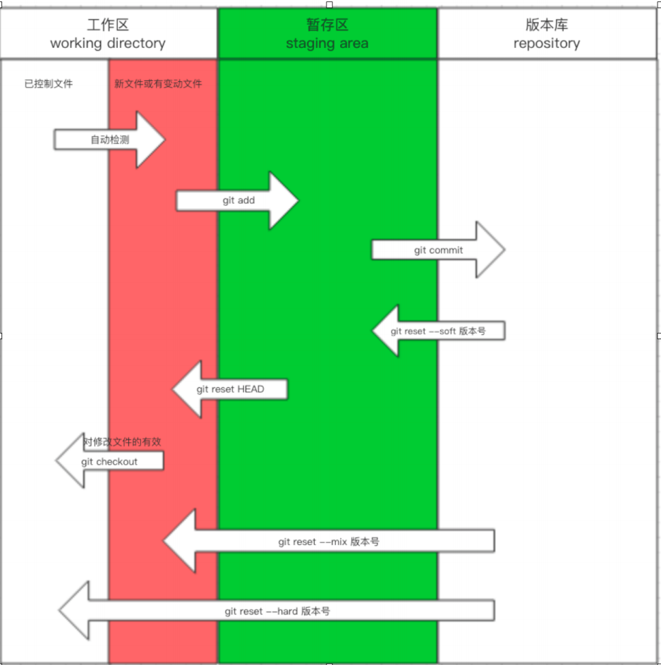
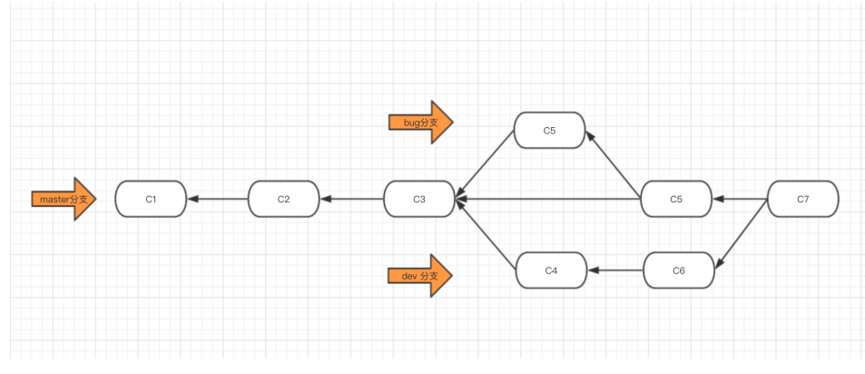
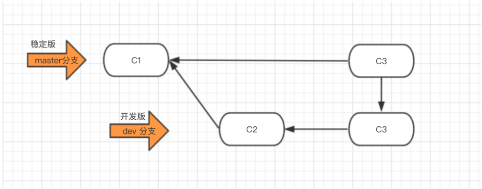
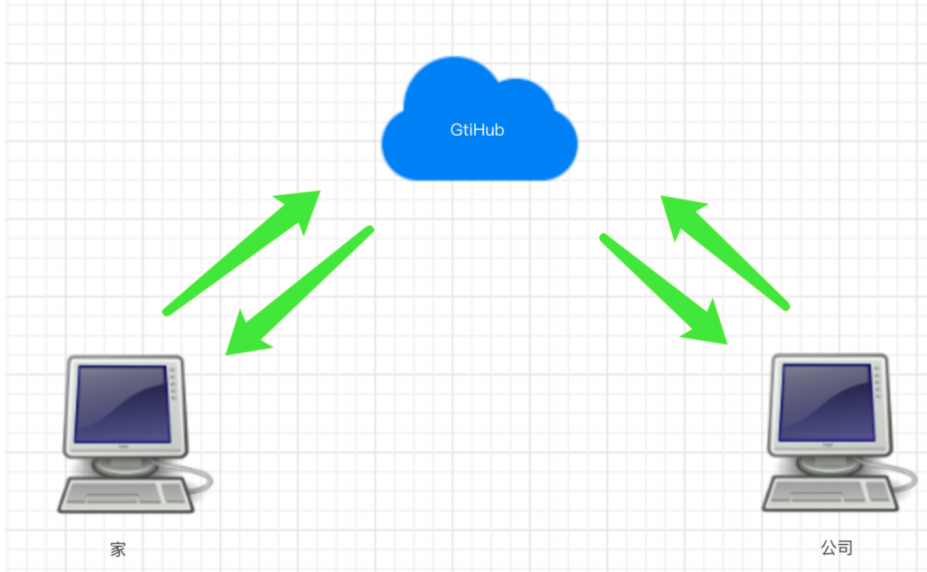
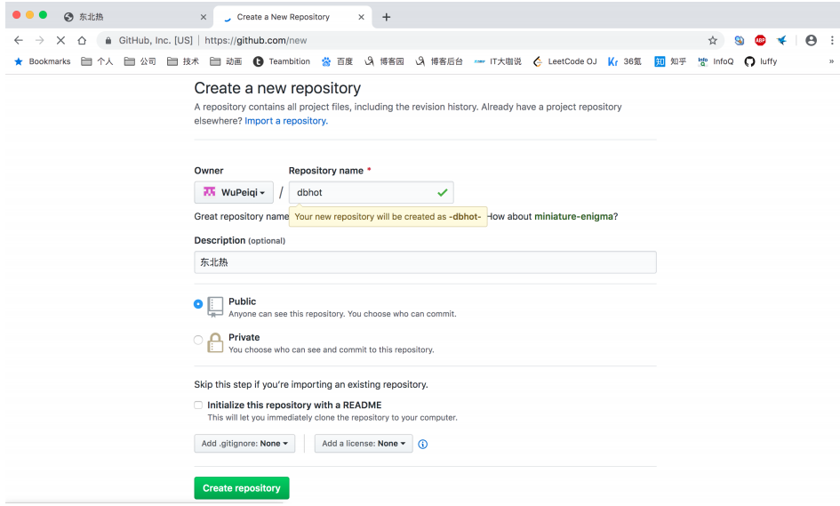
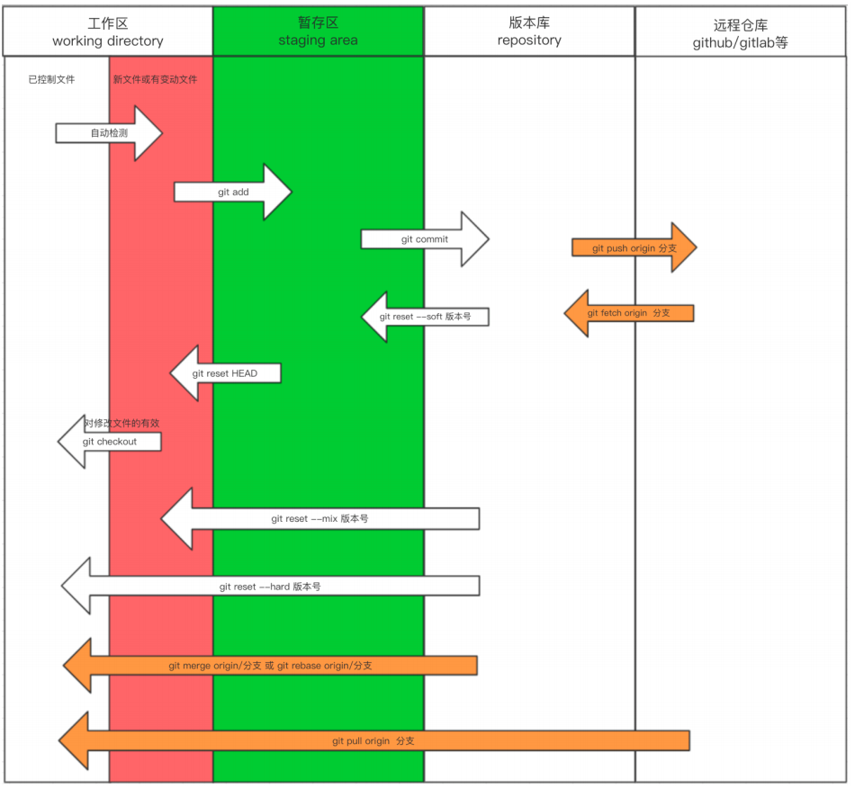
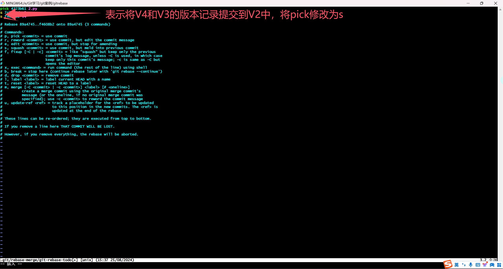
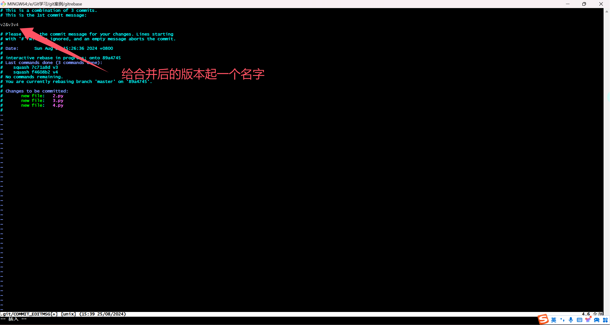
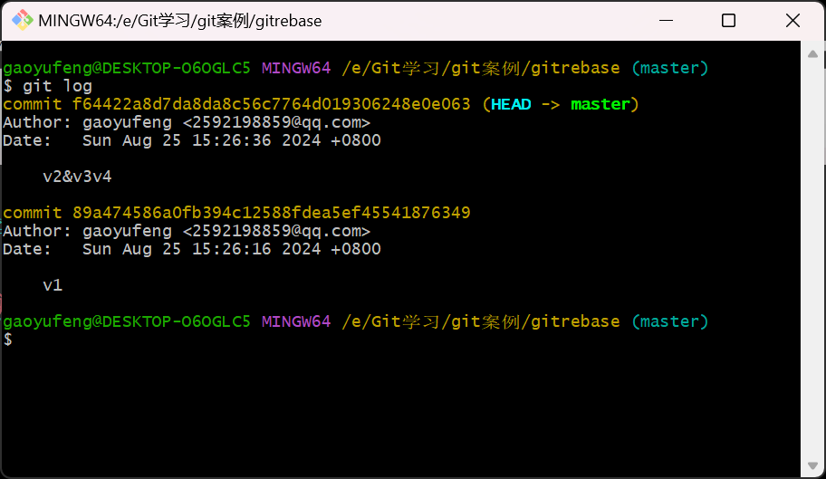

# Git实战


## 第一章 快速入门

### 1.1 什么是Git

Git是一个分布式的软件版本控制软件

- 软件，类似于QQ、office、dota等安装到电脑上去才能使用的工具
- 版本控制，类似于毕业论文、写文案、视频剪辑等，需要反复修改和保留原历史数据。
- 分布式
  - 文件夹拷贝
  - 本地版本控制
  - 集中式版本控制
  - 分布式版本控制

### 1.2为什么要做版本控制

要保留之前的所有版本，以便回滚和修改

### 1.3安装Git

详见:https://git-scm.com/book/zh/v2/%E8%B5%B7%E6%AD%A5-%E5%AE%89%E8%A3%85-Git


## 第二章 “东北热”创业史

### 2.1 第一阶段：单枪匹马开始干

想要让git对一个目录进行版本控制需要以下步骤:

- 需要管理的文件夹

- 执行初始化命令

  ```
  git init
  ```

- 管理目录下的文件状态

  ```
  git status
  注：新增的文件和修改过后的文件都是红色
  ```

- 管理制定文件（红变绿）

  ```
  只管理指定文件名的文件
  git add 文件名
  将所有修改和新增的文件都管理
  git add .
  ```

- 个人信息配置：用户名、邮箱【初次配置一次即可】

  ```
  git config --global user.email "2592198859@qq.com"
  git config --global user.name "gaoyufeng"
  ```

- 生成版本

  ```
  git commit -m '版本描述信息'
  ```

- 查看版本记录

  ```
  git log
  ```

### 2.2 第二阶段：扩展新功能(短视频)

```
touch 短视频.py
git add 短视频.py
git commit -m '短视频'
```


### 2.3 第三阶段："约饭事件"

- 回滚至之前版本

```
git log
git reset --hard 版本号
```

- 回滚至之后版本

```
查看所有的版本
git reglog
git reset --hard 版本号
```

### 2.4 小总结

```
git init
git add
git commit
git log
git reflog
git reset --hard 版本号
```



### 2.5 第四阶段：商城&紧急修复bug

#### 2.5.1 分支

分支可以给使用者提供多个开发环境，意味着你可以把你的工作从开发主线上分离开来，以免影响开发主线。

#### 2.5.2 紧急修复bug方案



#### 2.5.3 命令总结

- 查看分支

  ```
  git branch
  ```

- 创建分支

  ```
  git branch 分支名称
  ```

- 切换分支

  ```
  git checkout 分支名称
  ```

- 分支合并（可能产生冲突）

  ```
  git merge 要合并的分支
  注意：切换分支在合并
  ```

- 删除分支

  ```
  git branch -d 分支名称
  ```

#### 2.5.4 工作流



### 2.6 第五阶段进军三里屯

有钱之后就要造呀，一个人在三里屯买了一层楼做办公室



#### 2.6.1 第一天上班前在家上传代码

首先，需要注册github账号，并且创还能远程仓库，然后再执行如下命令，将代码上传到github。



```
1. 给远程仓库起别名
git remote add origin https://github.com/gaoyufeng66/git_study.git
2. 向远程推送代码
git push -u origin 分支名称
注：-u 是指定默认的分支名称,之后可以使用git push即可自动上传到默认的分支中,前期不熟不建议使用
```

#### 2.6.2 初次在公司新电脑上下载代码

```
1. 克隆远程仓库的代码（适用于本地一点代码也没有，第一次从远程仓库拷贝代码）
git clone 远程仓库地址（内部已实现 git remote add origin 远程仓库地址）
2. 切换分支
git checkout 分支名称
```

在公司下载完代码后，继续开发

```
1. 切换到dev分支进行开发
	git checkout dev
2. 把master分支合并到dev[仅一次]
	git merge master
3. 开发修改代码
4. 提交代码
	git add .
	git commit -m 'xx'
	git push origin dev 
```

#### 2.6.3 下班回到家继续写代码

```
1. 切换到dev分支进行开发
	git checkout dev
2. 将远程仓库的代码拉下来更新本地仓库（适用于本地有代码，需要更新和继续开发的场景）
	git pull origin dev
	注：git pull 等价于 git fetch 和 git merge
3. 继续开发
4. 提交代码
	git add .
	git commit -m 'xx'
	git push origin dev
```

#### 2.6.4 回到公司继续开发

```
1. 切换到dev分支进行开发
	git checkout dev
2. 将远程仓库的代码拉下来更新本地仓库（适用于本地有代码，需要更新和继续开发的场景）
	git pull origin dev
3. 继续开发
4. 提交代码
	git add .
	git commit -m 'xx'
	git push origin dev
```

。。。。一直这样循环

#### 2.6.5 开发完毕，准备上线

```
1. 将dev分支合并到master分支，进行上线
	git checkout master
	git merge dev
	git push origin master
2. 把dev分支也推到远程代码仓库
	git checkout dev
	git merge master
	git push origin dev
```

#### 2.6.6 在公司约妹子忘记提交代码

```
1. 在公司拉代码
	git pull origin dev
	发现没有在公司写的代码
2. 在公司开发其他功能
	git add .
	git commit -m 'xx'
3. 由于和妹子吃饭忘记push
```

#### 2.6.7 到家继续写代码

```
1.  到家拉取代码（发现没有更新，发现在公司写的代码忘记提交）
	git pull origin dev
2.	开发其他功能
3.	把dev分支推送到远程
	git add .
    git commit -m 'xx'
    git push origin dev
```

#### 2.6.8 到公司继续写代码

```
1. 在公司拉取代码，把在家写的代码拉取到本地（有合并，可能会产生冲突）
	当同一个代码文件，同一行写入的内容不一样时会产生冲突
	git pull origin dev
2. 手工解决冲突
3. 继续开发其他功能
4. 把dev分支推到远程
	git add .
	git commit -m 'xx'
	git push commit dev
```

#### 2.6.9 git pull

```
直接将远程代码仓库的dev拉取并合并到本地dev中
git pull origin dev
等价于
先将远程仓库的代码拉取到本地的版本库中
git fetch origin dev
再讲版本库中拉到的最新的代码合并到工作区中
git merge origin/dev
```



#### 2.6.9 rebase的作用？

##### 2.6.9.1 rebase场景一：将多个版本记录合并为一个版本记录

rebase可以保证提交记录简洁，不分叉 ，可以将多个版本合并为一个版本

==尽量不要将已经移交到远程代码仓库的版本（已push的版本）进行合并，不然会因代码版本记录不一致而产生问题==

```
touch 1.py
git add .
git commit -m 'v1'

touch 2.py
git add .
git commit -m 'v2'

touch 3.py
git add .
git commit -m 'v3'

touch 4.py
git add .
git commit -m 'v4'

git log

可以用以下两个方法将将版本合并
git rebase -i 版本号
git rebase -i HEAD~3
注意：修改后要用wq命令保存，需要合并版本将前面的pick修改为s，表示将V3和V4版本合并为V2版本
```

将pick修改为s

```
（ i 是插入,dd 是删除一行 :wq是保存  :q!是强制退出）
```



给合并后的版本起一个名字



最终版本效果如下图所示



##### 2.6.9.2 rebase场景二：将dev分支合并到master分支并只有一条分支

将dev分支合并到主分支，只有一条分支

```
git log版本记录分支图形化
git log --graph
git log版本记录分支图形化简洁版（只有版本号和版本名称）
git log --graph --pretty=format:"%h %s"

只想有一个分支，将dev分支删掉并合并到master分支中
git checkout dev
git rebase master 
git checkout master
git merge dev
```

##### 2.6.9.3 rebase场景三：git pull 可以替换为 git fetch 和 git rebase

```
正常拉取数据：
git pull origin dev
替换为（也可以将dev分支合并到master分支并只有一条分支）：
git fetch origin dev
git rebase origin/dev
```

注意：git rebase 产生冲突

场景：在master分支和在dev分支修改了同一个文件，产生冲突


解决方案: 

```
解决冲突文件
git add .
git rebase --continue
然后确认版本名称(会自动弹出)
git checkout master
git merge dev
```

#### 2.6.10 Araxis merge工具的使用（快速解决冲突）

首先找到配置文件路径  ==C:\Users\gaoyufeng\.gitconfig==

自定义notepad++快捷键（Ctrl + Shift + C 复制当前文件路径 Ctrl + Shift + D 打开当前文件所在位置）

将配置文件修改为如下内容：其中 araxis merge的路径替换为系统真实路径

```
[i18n]
	commitencoding = utf-8
	logoutputencoding = utf-8
[core]
	quotepath = false
[user]
	name = gaoyufeng
	email = 2592198859@qq.com
[http]
	sslVerify = false
[diff]
    external = \"D:\\Araxis\\Araxis Merge\\araxisgitdiff.exe\"
[mergetool "araxis"]
    cmd = \"D:\\Araxis\\Araxis Merge\\araxisgitmerge.exe\" \"$BASE\" \"$LOCAL\" \"$REMOTE\" \"$MERGED\"
    trustExitCode = true
[mergetool]
keepBackup = false

[merge] 
tool = araxis
stat = true
```

当使用merge或者pull产生冲突时，可以用 git mergetool 冲突文件名 来快速处理冲突

注意：也可以使用beyond compare 来处理

#### 总结

-  添加远程代码仓库链接

  ```
  git remote add origin 地址
  ```

-  推送代码

  ```
  git push origin dev
  ```

- 下载代码

  ```
  git clone 地址
  ```

- 拉取代码

  ```
  git pull origin dev
  等价于
  git fetch origin dev
  git merge origin/dev
  ```

- 保持代码提交整洁（变基）

  ```
  git rebase 分支
  ```

- 记录的图形展示

  ```
  git log --graph --pretty=format:"%h %s"
  ```


